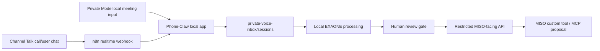

# Phone-Claw Submission Pack

## Tagline

일상의 모든 Voice를, 에이전트와 함께

## One-Liner

Phone-Claw turns calls, meetings, and voice notes into private local agent context, then exposes only reviewed, redacted handoff payloads to workflow tools such as MISO.

## Problem

업무 맥락은 통화와 회의에 많이 남지만, 에이전트는 보통 텍스트와 JSON만 안정적으로 다룬다. 민감한 통화 전사문을 그대로 외부 워크플로우에 넣으면 개인정보와 회사 기밀 리스크가 커진다.

## Solution

Phone-Claw is a local voice bridge:

1. Collect voice-derived text from Channel Talk/n8n or the local Private Mode form.
2. Store source material and transcripts only in the local `private-voice-inbox`.
3. Use local EXAONE post-processing to create summary, urgency, teams, action items, and review reasons.
4. Require human review before any external workflow handoff.
5. Expose only redacted payloads through the restricted MISO-facing API.

## Architecture



## Sponsor Fit

LG U+ Track:

- Voice AI use case: calls, meetings, and voice notes become structured agent input.
- EXAONE is in the processing pipeline.
- Local-first design keeps raw voice context on the operator machine.

GS Neotek / MISO Track:

- Phone-Claw proposes a practical inbound handoff pattern for MISO workflows.
- Current MISO path is a restricted custom tool/OpenAPI and MCP proposal, not an unsupported direct push.
- The API blocks payload access until human review approves external workflow use.

## Demo Script

1. Open `http://localhost:3000`.
2. Show the four-step golden path: Voice 수집, EXAONE 후처리, Human Review, MISO 제안.
3. Show `Private Mode` as the local meeting/voice input path.
4. Open synthetic proof session `20260530T153141_utc_channel_talk_e7b435ae0b`.
5. Show local transcript, EXAONE output, review approval, and MISO redacted payload.
6. Explain that the proof session is synthetic and real customer raw transcripts are not used for external demo payloads.

## Verification

```bash
pnpm typecheck
pnpm build
pnpm smoke:local
```

`pnpm smoke:local` verifies the credential-free path:

- temporary local app server starts
- bundled sample payload is ingested
- fallback-local processing works without model files
- MISO payload is blocked before review
- approved redacted payload becomes available after review
- local voice frontdoor creates a `local_voice_upload` session

## Demo Evidence

- Realtime Channel Talk webhook proof session: `20260530T153141_utc_channel_talk_e7b435ae0b`
- Current GitHub repo: `https://github.com/man2service/Phoneclaw`
- Main docs:
  - `README.md`
  - `docs/demo-intro.md`
  - `docs/channel-talk-webhook.md`
  - `miso/README.md`
  - `miso/proposed-miso-interfaces.md`
  - `miso/proposed-inbound-voice-event.schema.json`

## Security Boundary

- Do not commit `.env.local`, `private-voice-inbox/`, `n8n-data*/`, `models/`, raw transcripts, or audio files.
- MISO-facing responses never include raw audio or raw transcript text.
- `PHONE_CLAW_INGEST_SECRET` protects local ingest/MISO tool endpoints.
- Human review is required before external workflow access.

## Known Limitations

- Channel Talk webhook creation through Open API returned server-side `500`; the working registration path is Channel Talk UI.
- Cloudflare quick tunnel URLs are ephemeral and must be updated after restart.
- MISO direct inbound voice event ingest is not documented; Phone-Claw provides a custom tool/OpenAPI and MCP proposal instead.
- ixi-O direct integration is a planned extension: “ixi-O 통화와 연동하여 더 강력해져요”.
