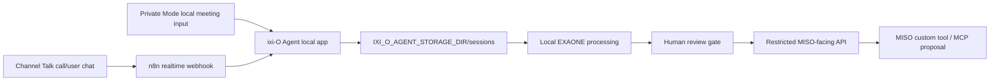

# ixi-O Agent Submission Pack

## Tagline

일상의 모든 Voice를, 에이전트와 함께

## One-Liner

ixi-O Agent turns calls, meetings, and voice notes into private local agent context, then exposes only reviewed, redacted handoff payloads to workflow tools such as MISO.

## Problem

업무 맥락은 통화와 회의에 많이 남지만, 에이전트는 보통 텍스트와 JSON만 안정적으로 다룬다. 민감한 통화 전사문을 그대로 외부 워크플로우에 넣으면 개인정보와 회사 기밀 리스크가 커진다.

## Solution

ixi-O Agent is a local voice bridge:

1. Collect voice-derived text from Channel Talk/n8n or the local Private Mode form.
2. Store source material and transcripts only under the local `IXI_O_AGENT_STORAGE_DIR`.
3. Use local EXAONE post-processing to create summary, urgency, teams, action items, and review reasons.
4. Require human review before any external workflow handoff.
5. Expose only redacted payloads through the restricted MISO-facing API.

## Public Showcase

- Vercel showcase: `https://ixi-o-agent.vercel.app`
- Static source: `apps/showcase-static/`
- Local Next.js version: `http://localhost:3000/showcase`

The public showcase is a safe interactive mockup. It shows two selectable
experience modes:

- Enterprise flow: Channel Talk data -> Mac mini M4 local processing -> Whisper STT -> EXAONE summary -> PII masking -> decision-only agent handoff.
- Personal flow: local recorder/file -> Whisper STT -> EXAONE full-context summary -> full transcript and summary handoff to the user's personal agent.
- TDS-inspired design section: primary/weak button hierarchy, short status badges, ListRow-style artifact handoff, and segmented Enterprise/Personal switching.

It does not include raw transcripts, local model execution, Channel Talk
credentials, or any customer data.

Design implementation note: the showcase uses ixi-O Agent's own semantic CSS
tokens and components. Toss UI Kit assets are not copied or imported. Visual
materials use an LG U+ / ixi-O-inspired palette with LG RED as the primary
anchor and a restrained digital purple secondary accent; see
`docs/tds-inspired-design-system.md` for the source review, token locations,
and license boundary.

## Architecture



## Sponsor Fit

LG U+ Track:

- Voice AI use case: calls, meetings, and voice notes become structured agent input.
- EXAONE is in the processing pipeline.
- EXAONE is used after STT, not as the STT engine: Whisper turns audio into
  text, then EXAONE summarizes, extracts decisions, proposes action items, and
  creates agent-readable context.
- Local-first design keeps raw voice context on the operator machine.
- Personal and enterprise flows demonstrate why EXAONE is useful after STT:
  summarization, decision extraction, action candidates, and agent-readable
  context creation.

GS Neotek / MISO Track:

- ixi-O Agent proposes a practical inbound handoff pattern for MISO workflows.
- Current MISO path is a restricted custom tool/OpenAPI and MCP proposal, not an unsupported direct push.
- The API blocks payload access until human review approves external workflow use.

## Demo Script

1. Open `https://ixi-o-agent.vercel.app` for the public overview.
2. Show the interactive experience flow in Enterprise mode: Channel Talk input,
   Mac mini local AI, PII masking, agent-folder handoff.
3. Switch to Personal mode and show that the same product can send full
   transcript plus summary to a personal agent without enterprise masking.
4. Open `http://localhost:3000` for the real local demo.
5. Show `Private Mode` as the local meeting/voice input path.
6. Open synthetic proof session `20260530T153141_utc_channel_talk_e7b435ae0b`.
7. Show local transcript, EXAONE output, review approval, and MISO redacted payload.
8. Explain that the proof session is synthetic and real customer raw transcripts are not used for external demo payloads.

## FriendliAI Option

Default inference remains local on the Mac mini M4. FriendliAI is a practical
optional hosted path when local inference is too slow or when a stable hosted GPU
endpoint is useful for demos. The current page and local mock flow do not require
an API key. Actual hosted calls should read `FRIENDLI_TOKEN` from local
`.env.local` only.

Official references checked:

- Friendli OpenAI compatibility: `https://friendli.ai/docs/guides/openai-compatibility`
- Friendli EXAONE 4.0 Dedicated Endpoint guide: `https://friendli.ai/docs/guides/tutorials/getting-started-with-exaone-4.0`
- Friendli serverless Whisper transcription API: `https://friendli.ai/docs/openapi/serverless/audio-transcriptions`

## Verification

Credential-free fallback proof:

```bash
pnpm typecheck
pnpm build
pnpm smoke:local
```

`pnpm smoke:local` verifies the credential-free path:

- temporary local app server starts
- bundled sample payload is ingested
- fallback-local processing works without model files
- MISO payload is blocked before review
- approved redacted payload becomes available after review
- local voice frontdoor creates a `local_voice_upload` session

Real local model proof on the Mac mini M4:

```bash
pnpm check:stt
pnpm smoke:exaone
```

`pnpm check:stt` proves local Whisper STT when `whisper-cli` and
`models/whisper/ggml-small.bin` are installed. `pnpm smoke:exaone` proves local
EXAONE GGUF inference by requiring `engine: "exaone-local"` and
`modelAvailable: true`. These are separate from the fallback smoke test so
judges can distinguish "works without model files" from "real EXAONE ran".

## Demo Evidence

- Realtime Channel Talk webhook proof session: `20260530T153141_utc_channel_talk_e7b435ae0b`
- Current GitHub repo: `https://github.com/man2service/ixi-o-agent`
- Long-run goal plan: `docs/agent-goal-plan.md`
- MISO judging runbook: `docs/miso-track-submission-runbook.md`
- User-owned final actions: `TODO_USER_ACTIONS.md`
- MISO app import draft: `miso/apps/ixi-o-agent-voiceops-copilot.yml`
- MISO fallback samples:
  - `miso/samples/approved-voice-session-handoff.sample.json`
  - `miso/samples/blocked-voice-session-detail.sample.json`
- Main docs:
  - `README.md`
  - `docs/demo-intro.md`
  - `docs/channel-talk-webhook.md`
  - `miso/README.md`
  - `miso/proposed-miso-interfaces.md`
  - `miso/proposed-inbound-voice-event.schema.json`

## Security Boundary

- Do not commit `.env.local`, `private-voice-inbox/`, `n8n-data*/`, `models/`, raw transcripts, or audio files.
- MISO-facing responses never include raw audio or raw transcript text.
- `IXI_O_AGENT_INGEST_SECRET` protects local ingest/MISO tool endpoints.
- Live MISO demos expose only `pnpm miso:gateway` through the tunnel, not the
  full local Next app.
- MISO receives a short-lived `IXI_O_AGENT_MISO_GATEWAY_TOKEN`; the gateway maps
  that to the local ingest secret.
- The gateway now fails closed if `IXI_O_AGENT_MISO_GATEWAY_TOKEN` is missing,
  so MISO never reuses the long-lived local ingest secret as its bearer token.
- Legacy `PHONE_CLAW_*` env vars and `x-phone-claw-ingest-secret` headers remain
  readable only to keep existing local demos from breaking during the rename.
- Human review is required before external workflow access.

## Known Limitations

- Channel Talk webhook creation through Open API returned server-side `500`; the working registration path is Channel Talk UI.
- Cloudflare quick tunnel URLs are ephemeral and must be updated after restart.
- MISO direct inbound voice event ingest is not documented; ixi-O Agent provides a custom tool/OpenAPI and MCP proposal instead.
- ixi-O direct integration is a planned extension: “ixi-O 통화와 연동하여 더 강력해져요”.
